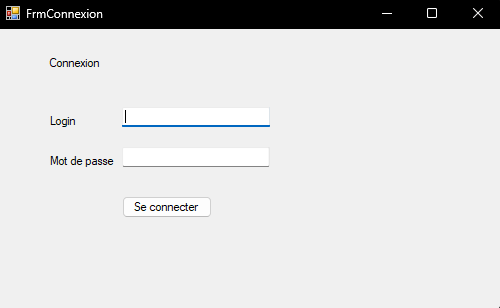
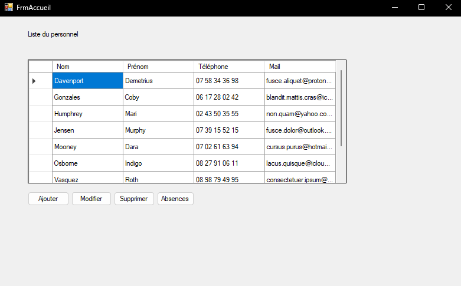
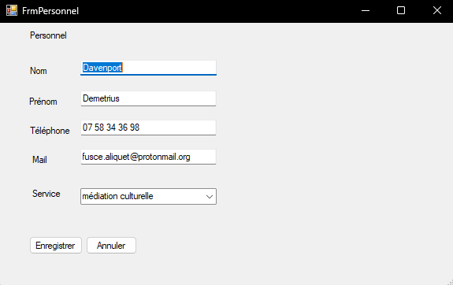
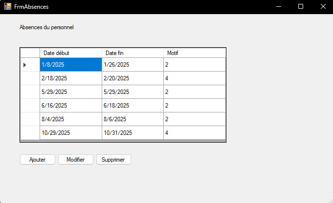
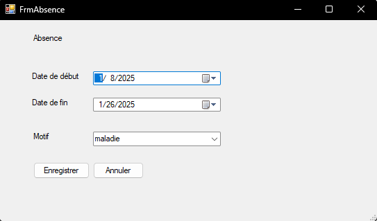

# MediaTek86

Application réalisée en C# WinForms pour MediaTek86.

## Présentation

Le projet consiste à créer une application de gestion pour une médiathèque.

L’application permet à un responsable de gérer le personnel et les absences.

## Fonctionnalités

- connexion d’un responsable
- affichage du personnel
- ajout, modification et suppression d’un personnel
- affichage des absences d’un personnel
- ajout, modification et suppression d’une absence
- contrôle des dates d’absence
- éviter deux absences sur la même période

## Base de données

L’application utilise une base de données MySQL nommée mediatek86

La connexion utilisée pour l'application est :

- base en local : localhost
- utilisateur MySQL : root
- mot de passe : vide
- nom de la base : mediatek86

## Installation

L’installateur se trouve dans le dossier `MediaTek86_Setup/Debug`.

Ce dossier contient les fichiers `setup.exe` et `MediaTek86_Setup.msi`.

Pour que l’application fonctionne, il faut aussi avoir la base de données `mediatek86`.

Le fichier SQL se trouve dans le dossier `sql`, sous le nom `mediatek86.sql`.

## Connexion à l’application

Compte de test pour se connecter à l’application :

- login : admin
- mot de passe : admin

## Organisation du dépôt

- `MediaTek86_Projet` : code de l’application
- `MediaTek86_Setup` : installateur
- `sql` : dossier contenant le script SQL de la base
- `README.md` : présentation du projet

## Suivi du projet

Le projet a été suivi avec GitHub et un tableau Kanban.

Les principales étapes ont été :

- création du projet
- création des fenêtres
- connexion à la base de données
- gestion du personnel
- gestion des absences
- tests
- documentation
- installateur

## Captures des interfaces

### Connexion

### Accueil

### Gestion du personnel

### Gestion des absences

### Formulaire d'absence

## Organisation du code

Le projet est rangé en plusieurs parties :

- `Vue` : les fenêtres de l’application
- `Controleur` : les traitements liés au personnel, aux absences et à la connexion
- `Modele` : les classes utilisées dans le projet
- `dal` : l’accès aux données
- `bddmanager` : l’exécution des requêtes SQL
